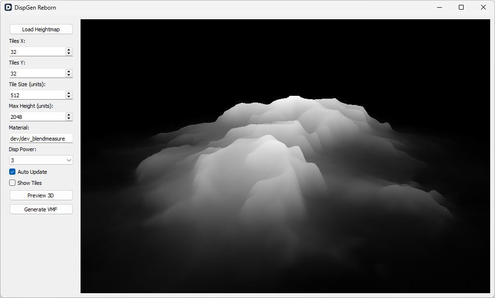

# DispGen Reborn - v1.0 

## First Release
This initial version includes core functionality for transforming grayscale heightmaps into Source SDK displacement VMF prefabs, allowing easy terrain creation for your Source Engine projects.
#### [Download v1.0](https://github.com/Ammarillo/DispGen-Reborn/releases/download/v1.0/DispGen-Reborn-v1.0.exe)

## Features:
- **Heightmap conversion:** Quickly convert grayscale heightmaps to displacement VMF prefabs.
- **Live 3D preview:** Instantly visualize and adjust your terrain settings with a real-time 3D preview.
- **Customizable settings:** Customize tile size, displacement power and material to suit your project requirements.

## Getting Started:
1. Load your heightmap image.
2. Adjust the settings to your preference.
3. Preview in 3D.
4. Export the terrain as a VMF prefab ready for Source SDK.