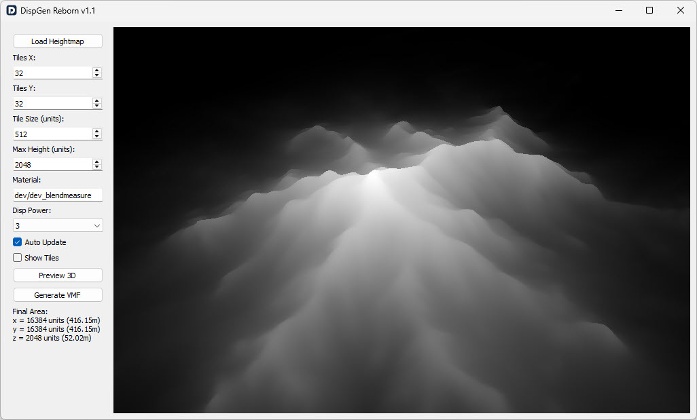

# DispGen Reborn - v1.1 

## What's New in v1.1
This update improves accuracy and usability for terrain generation:
- **Final Area Display:** The total dimensions of the generated terrain are now displayed. This helps ensure proper scaling when integrating the terrain into your map.
- **Image Flip Fix:** Fixed a bug that caused loaded heightmaps to be flipped along the X-axis.
- **Solid Height Fix:** Instead of matching the terrain height, the base solid beneath the displacement now has a consistent height of 16 units.

#### [Download v1.1](https://github.com/Ammarillo/DispGen-Reborn/releases/download/v1.1/DispGen-Reborn-v1.1.exe)

## Features:
- **Heightmap conversion:** Quickly convert grayscale heightmaps to displacement VMF prefabs.
- **Live 3D preview:** Instantly visualize and adjust your terrain settings with a real-time 3D preview.
- **Customizable settings:** Customize tile size, displacement power and material to suit your project requirements.

## Getting Started:
1. Load your heightmap image.
2. Adjust the settings to your preference.
3. Preview in 3D.
4. Export the terrain as a VMF file to your prefab folder.
5. Go to Hammer and select the "Entity Tool."
7. In the "Categories" dropdown menu, change the category to "Prefabs"
8. From the "Objects" dropdown menu, select your generated VMF file.
9. Click "Insert original prefab".
10. Done!
